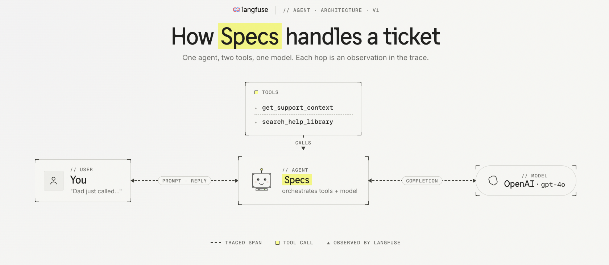
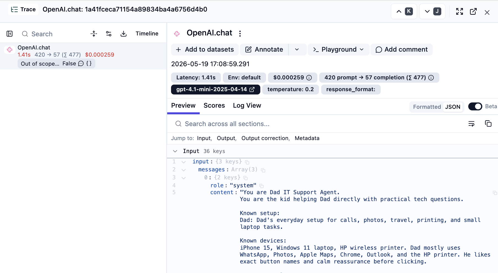
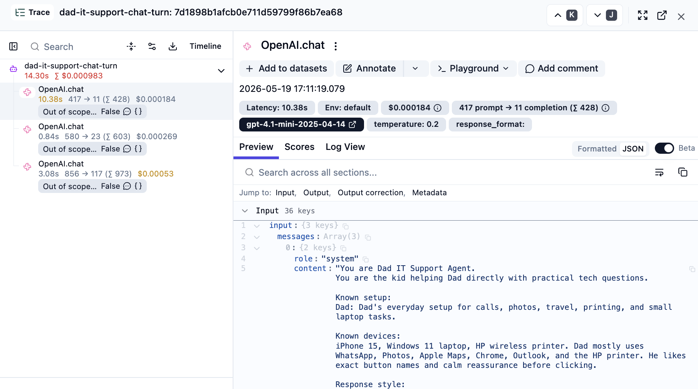
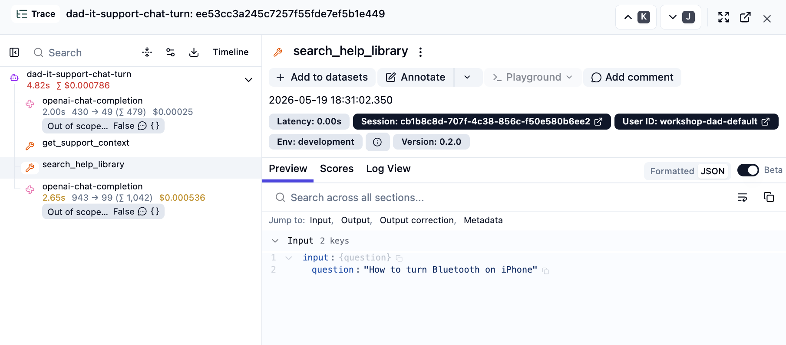

# 02 Tracing

## Starting point

```bash
git checkout checkpoint/02-tracing-start
```

This is the blank slate for the tracing step — same code as `checkpoint/01-base-app`, with no Langfuse wiring yet. The Langfuse packages are already in `package.json` — run `npm install` if you haven't. Make sure `.env` has your `OPENAI_API_KEY` and Langfuse keys.

## Why we trace

TODO:Here is a very short paragraph on why tracing is important, and then let's link to our academy page on tracing. Tracing helps you log every step your agent is taking to achieve a certain goal and makes it possible for you to review inputs and outputs after things have happened. It is transparency into what is actually going on in your system and which inputs and outputs are seen in which order. Make a nicer sentence out of it, and then say that if you want to learn more about tracing and why it's important, you can check out our academy page. And say if people want the technicalities, they can check out the docs page.

## Goal

TODO: In the short explanation, whenever the agent asks something, it first says "bupubu" then looks up the user information, something like this. To really see if this is going on, we want to log each of these steps. The goal is to make one chat turn and ask the trace with the agent run bupubu.

Make one chat turn a nested trace with the agent run, the OpenAI generation, and the two tool calls — built up in three steps that mirror the agent's structure.



We will build up the trace in three steps:

1. **First trace** — log the OpenAI generations themselves.
2. **Nested traces** — group the generations under one agent run per turn.
3. **Recording tool calls** — make each tool invocation its own observation.

User/session attribution and tags come in `04-monitoring`.
TODO: Don't talk about attribution. This is a weird word. Let's say user and session information will be picked up in 04 monitoring. Skip the tags. We don't want tags.

## Step 1 — First trace

We want observability on the OpenAI calls themselves to see what the inputs and outputs are, and how much cost, tokens and time is spent. Two changes are enough.

### `src/server/index.ts`

Start the Langfuse span processor near the top of the file:

```ts
import { NodeSDK } from "@opentelemetry/sdk-node";
import { LangfuseSpanProcessor } from "@langfuse/otel";

new NodeSDK({ spanProcessors: [new LangfuseSpanProcessor()] }).start();
```

The processor reads `LANGFUSE_PUBLIC_KEY`, `LANGFUSE_SECRET_KEY`, and `LANGFUSE_BASE_URL` from the environment.

### `src/server/support-agent.ts`

Wrap the OpenAI client at module scope:

```ts
import { observeOpenAI } from "@langfuse/openai";

const openai = observeOpenAI(new OpenAI({ apiKey: env.openaiApiKey }));
```

**Then replace the call** in `runSupportConversation` — find:

```ts
const response = await getOpenAIClient().chat.completions.create({
```

and change it to:

```ts
const response = await openai.chat.completions.create({
```

The old `getOpenAIClient()` helper becomes unused and can be deleted.


**Verify:** `npm run dev`, ask one question, refresh Langfuse — you should see one generation per OpenAI call with prompt, response, tokens, and latency. Each generation is still its own top-level trace; we fix that next.



## Step 2 — Nested traces

To put the generations into context we group them under one agent run per turn. Three edits in `src/server/support-agent.ts` — no function body changes.

**1. Add the import:**

```ts
import { observe } from "@langfuse/tracing";
```

**2. Demote the existing function.** Find:

```ts
export async function runSupportConversation(request: ChatRequest): Promise<ChatResponse> {
```

Drop the `export` and rename it:

```ts
async function runSupportConversationInner(request: ChatRequest): Promise<ChatResponse> {
```

The body stays exactly as it is.


**3. Add the wrapped export at the bottom of the file:**

```ts
export const runSupportConversation = observe(runSupportConversationInner, {
  name: "dad-it-support-chat-turn",
  asType: "agent"
});
```

`index.ts` still imports `runSupportConversation` the same way. `observe(...)` auto-captures the function argument as the trace input and the return value as the trace output.

**Verify:** one chat turn should now show up as a single `dad-it-support-chat-turn` observation with the OpenAI generation nested underneath.




## Step 3 — Recording tool calls

The OpenAI generation already mentions the tool calls in its `tool_calls` output, but we have no observation for the actual tool execution — no way to see what input went in and what came out. The same `observe(...)` pattern, can be applied to each tool.

### `src/server/tools.ts`

Add the import and the two observed helpers above `executeTool`, then redirect the switch at them. `TOOL_DEFINITIONS` stays untouched.

```ts
import { observe } from "@langfuse/tracing";

const getSupportContextTool = observe(
  async () => {
    const context = getSupportContext();

    return {
      ok: true,
      context: {
        id: context.id,
        label: context.label,
        devices: context.devices,
        deviceSummary: context.deviceSummary,
        responseStyle: context.responseStyle,
        scopeHighlights: context.scopeHighlights,
        notableApps: context.notableApps
      }
    };
  },
  { name: "get_support_context", asType: "tool" }
);

const searchHelpLibraryTool = observe(
  async (input: { question: string }) => {
    const guides = searchGuides(input.question);

    return {
      ok: true,
      results: guides.map((guide) => ({
        id: guide.id,
        title: guide.title,
        summary: guide.summary,
        steps: guide.steps,
        caution: guide.caution ?? null
      }))
    };
  },
  { name: "search_help_library", asType: "tool" }
);

export async function executeTool(name: string, input: Record<string, unknown>): Promise<ToolResult> {
  switch (name) {
    case "get_support_context":
      return getSupportContextTool();

    case "search_help_library":
      return searchHelpLibraryTool({ question: String(input.question ?? "") });

    default:
      return { ok: false, error: `Unsupported tool: ${name}` };
  }
}
```




## How to verify you are done

- A single user turn creates one trace in Langfuse.
- Root observation: `dad-it-support-chat-turn` (type `agent`).
- Child generation from `observeOpenAI(...)` with prompt, response, tokens, latency.
- Child tool observations: `get_support_context`, `search_help_library`.
- Root input is the chat request; root output is the chat response.

## Wrap-up

Same pattern, different observation types, same concept: `observe(fn, { asType })` wraps a function and emits a span with the name and type you give it. `observeOpenAI(client)` is a specialized version of that wrap for the OpenAI SDK.

A more straightforward way to add rich tracing in line with Langfuse best practices is the **Langfuse Claude Code skill** (`/langfuse`). It applies the recommended patterns to your codebase without you hand-rolling each wrap. This walkthrough exists so you understand what the skill is doing under the hood.

## End state

This finished traced app is the starting point for `03-prompt-management` and `04-monitoring`.
