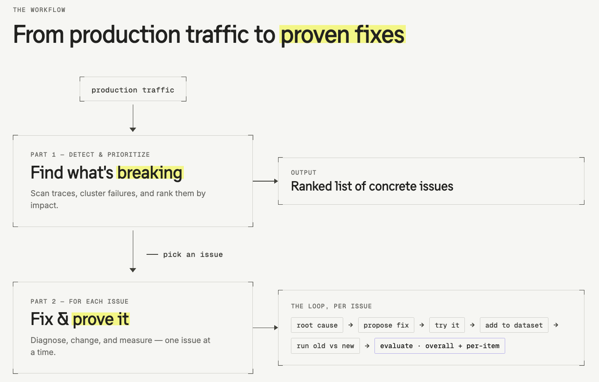

# 08 The self-healing loop

> **Prerequisite for this module: a coding agent.** Everything here is driven through a coding agent (Claude Code, Cursor, or any agent that can run a terminal and reach Langfuse) with the `langfuse` skill installed. If you don't have one set up, do that first — see [Step 0](#step-0--get-a-coding-agent-with-the-langfuse-skill).

## Starting point

```bash
git checkout checkpoint/07-evaluation
```

By now your agent is traced, monitored, has a hosted prompt, a dataset, and an experiment + evaluation workflow. **Every module so far was setup** — wiring Langfuse into the app and learning the moving parts by hand.

There is no separate code checkpoint for this lesson in the current repo snapshot. Module 08 starts from the finished module-07 app state and then hands the improvement loop to the coding agent.

If you stay on `main`, you may already be looking at the finished reference implementation for the module-08 prompt + evaluator changes. If you want the clean learner implementation step, actually check out `checkpoint/07-evaluation` before you start.

This module is different. It assumes the part that comes *after* setup, in real life:

- You already have **production traffic** flowing into Langfuse.
- That traffic has **real issues** in it — things going wrong that nobody wrote a ticket for yet.
- You want to **fix them**, and you want to do it by **leveraging your coding agent to self-heal the application.**

That's the whole module: the **self-healing loop**.

## How the self-healing loop works

The loop has two parts, and this module walks both.

**Part 1 — Detect & prioritize.** We help you automatically surface the *concrete* issues hiding in your production data — not a vague complaint, but specific, evidenced problems — and rank them by what they actually stem from and how much they matter. Out of that you pick the ones worth fixing.

**Part 2 — Fix & prove it (the for-loop).** Then, **for each prioritized issue you choose to fix**, we help you:

1. find a fix together with the coding agent,
2. try the fix out,
3. make sure it's represented in your dataset (so it can't silently regress), and
4. evaluate whether it actually worked — overall *and* per item.

> Think of Part 2 as a `for` loop over the prioritized issues. This module runs **one full iteration** end to end (the follow-up-questions issue), and the same loop applies to every other issue you find.



---

## Step 0 — Get a coding agent with the Langfuse skill

This module needs a coding agent, and that agent needs to know how to talk to Langfuse. In the current Langfuse skills repo, that means installing the single **`langfuse`** skill. The issue-triage and improvement-loop playbooks used below live inside that one skill — they are **not** separate skills to install.

> 🟦 **Prompt — install the `langfuse` skill**
>
> > "Please install the `langfuse` skill from `https://github.com/langfuse/skills/tree/main/skills/langfuse`."
>
> In this module, tell the agent to use:
> - the `langfuse` skill's **issue-detection triage** workflow for Part 1
> - the `langfuse` skill's **improvement loop** workflow for Part 2

The agent reaches your project through the keys already in `.env`:

```dotenv
LANGFUSE_PUBLIC_KEY=pk-lf-...
LANGFUSE_SECRET_KEY=sk-lf-...
LANGFUSE_BASE_URL=https://cloud.langfuse.com
```

> 💡 **Small note** — this module only uses one slice of what the `langfuse` skill can do. In your own project you can also use it to add tracing, manage prompts in Langfuse, and run the same self-improvement loop you see here.

---

## Step 1 — Use existing or pre-seeded production-like traffic

If your Langfuse project already has the production-like traffic you want to investigate, **skip this step**.

For workshop orgs, the intended setup is that a maintainer preloads realistic traces ahead of time using the committed production-trace seed bundle. The repo includes a one-command import for that:

```bash
npm run langfuse:seed
```

That command imports the committed bundle of traces, observations, and scores into the configured target Langfuse project.

If your facilitator already imported that workshop seed, or the project already has the right traces, just continue with that existing traffic.

---

## Step 2 — Detect issues from production (Part 1)

Now point the agent at your production data and let it find what's wrong. You don't translate the symptom into queries yourself — that's the agent's job.

Manually, you would choose a time window, filter out evaluator traffic, inspect traces and scores, and cluster the patterns yourself. Here, the agent is doing that work for you. You only need to watch the evidence, confirm the scope looks right, and agree with the issue list it brings back.

Recent Langfuse activity is often a mix of:

- real app traffic,
- `langfuse-llm-as-a-judge` evaluator traces, and
- `sdk-experiment` / `dataset-runner` traces from dataset runs.

When the agent says it is looking at "production" or "production-like" traffic, confirm that it excluded the evaluator + dataset-run slices and focused on the real app traces you care about.

> 🟦 **Prompt — find issues from production**
>
> > "Use the `langfuse` skill and follow its issue-detection triage workflow. Look at a significant recent amount of production traffic in Langfuse. Find the concrete issues — patterns of failures, bad scores, user friction, latency/cost anomalies — and rank them by severity with evidence (traces + scores) for each."

While the agent is doing that, you can open **Traces**, **Scores**, and **Sessions** in Langfuse and refresh as it works. The agent is still doing the actual investigation for you; you are watching the same evidence and confirming the conclusion.

> 🎬 **Video placeholder** — _[short screen recording of this running in Claude Code: the agent querying Langfuse, reading traces, and coming back with a ranked list.]_

### Example: what the agent might surface

_[TODO: trim/confirm against the live seeded data. These are the kinds of issues that come out:]_

- **Too many follow-up questions** — `asks_follow_up` fires on a large share of turns; users keep coming back to ask *"…and where do I find that?"* because answers aren't detailed enough for this user group (elderly, literal step-followers).
- **Out-of-scope requests** — a meaningful chunk of traffic is about laptops/PC/Windows for an iPhone-only agent, handled inconsistently.
- **High latency** — median ~11s/turn, driven by the model's reasoning + long answers.
- _[others as they appear]_

---

## Step 3 — Prioritize

From that ranked list, we pick what to fix first. For this module we choose:

> **Issue #1 — Too many follow-up questions.** The agent names an app or setting but doesn't tell the user *how to find and open it*, so each answer generates a "where is that?" follow-up. The information isn't detailed enough for our user group.

The rest of the module runs Part 2's loop on exactly this issue. (Every other issue would go through the same loop.)

---

## Step 4 — Fix the issue with your coding agent (Part 2)

Now hand the chosen issue to the agent and work the fix together.

Manually, you would read the traces, compare a few fix options, edit the prompt or code, publish a candidate, and verify the prompt state yourself. Here, the agent is doing that work and bringing the decision points back to you.

> 🟦 **Prompt — fix this issue**
>
> > "Use the `langfuse` skill and follow its improvement-loop workflow. Take the follow-up-questions issue. Find the root cause in the traces, propose a few fix options with trade-offs, and let's decide together what to try."

What the agent does, with you in the loop:

1. **Root cause** — reconstructs the conversations and shows the pattern with real traces (e.g. "every time it names an app, the next user message asks where it is"). Confirms the prompt has no rule preventing it.
2. **Propose options** — lays out a few avenues with trade-offs (prompt rule, retrieval change, examples, model/effort — *not always a prompt edit*). **You decide** which to try.
3. **Make the change** — for the chosen option (say, a prompt rule), the agent **proposes** a concrete edit. It does *not* silently publish to production.
4. **You accept** — review the diff; if you're happy with the wording, you approve it. Publish to a **non-production test label** (for this repo, `candidate`), never straight to `production`, unless you say otherwise.

For this workshop repository, keep the module-07 tone variant while you publish the candidate prompt:

```bash
LANGFUSE_PROMPT_LABEL=candidate WORKSHOP_PROMPT_VARIANT=gentler npm run prompt:publish
```

If your project is using a different live prompt variant, substitute that variant instead of `gentler`. The important thing is to compare **the same prompt variant** before and after your module-08 change.

While the agent is doing this, keep **Prompts** open in Langfuse and refresh to watch the `candidate` version appear. The agent does the publication work; you only need to confirm that the diff and label are the ones you want.

> 🎬 **Video placeholder** — _[recording of root-cause → options → proposed prompt diff → accept.]_

---

## Step 5 — Lock it into the dataset, then prove it worked

A fix with no test regresses the next time someone edits the prompt. So once you accept the change, the agent **proposes adding it to the dataset** — encoding the real failures as cases with the new expectation, then runs the experiment.

Manually, you would update the dataset, run the experiment twice, wait for the scores, inspect the run rows, and decide whether to ship. Here, the agent is doing those mechanics for you, and you step in to review the evidence and make the final call together.

1. **Add to the dataset** — new cases that mirror the production failures, with the desired behavior as the expectation (e.g. answers must say *how to find/open* the app: "Home Screen", "swipe", "search") and their own `category`.
2. **Run old vs. new** — seed the dataset, then run the experiment with the **old prompt** and the **new prompt** so we can compare.

   ```bash
   npm run dataset:seed
   LANGFUSE_PROMPT_LABEL=production npm run dataset:run
   LANGFUSE_PROMPT_LABEL=candidate npm run dataset:run
   ```

   The shell-scoped `LANGFUSE_PROMPT_LABEL=...` override is intentional. It lets you compare `production` vs `candidate` without editing `.env`.

   Both `dataset:run` commands are quiet while they run and can take a few minutes. The script prints the summary at the end rather than streaming per-item progress.

   In this repo, the follow-up fix is tracked by `first_answer_grounding` plus the existing `keyword_overlap` and `Correctness` checks.

3. **Read the results — overall *and* per item.** Did the new prompt improve the target metric overall? Are there **per-item regressions** — cases that got *worse* even if the average went up?
4. **Evaluate the verdict + caveats.** Open every per-item dip before you decide. Some drops will be real regressions; some will be evaluator noise or a wording mismatch in `expectedKeywords`. The agent helps you interpret that evidence and decide whether this is a real improvement over baseline, and whether it makes sense to promote.

Depending on your evaluator setup, judge-based scores can land a little after the run finishes. Refresh the run until the scores you care about have appeared on both rows before you compare them.

While the agent is running the compare, keep **Dataset → Runs** open in Langfuse and refresh. You should see the new run appear first, then the attached scores fill in. The agent is still the one running and comparing the experiment; you are watching and confirming the ship/no-ship decision.

> 🎬 **Video placeholder** — _[experiment comparison view: old vs new, overall delta + per-item, with a regression called out.]_

Only once it's proven and the caveats are acceptable do you promote the prompt to `production`.

---

## Where this is going

This was **one iteration** of the self-healing loop, on one issue. The point is that the loop is general:

- the same detect → prioritize → root-cause → fix → dataset → prove cycle applies to **any** issue Part 1 surfaces — out-of-scope handling, latency, retrieval quality, tone, whatever;
- the operator's job shifts from *doing the investigation* to *collaborating with the agent at clear handoff points*: framing the problem, reviewing evidence, choosing the fix, and making the final promotion decision;
- this is the direction we see things going: agents continuously do the heavy lifting in production, and humans step in where judgment matters most. The best results come from explicit human↔agent collaboration, not from either one working alone.

That's an agent that **self-heals**.

## How to verify you are done

- You either seeded production-like traffic **or intentionally skipped seeding because the relevant traffic was already in Langfuse**, and the agent investigated *that* data (measured symptom, not a guess).
- The agent surfaced a ranked list of concrete issues with trace/score evidence.
- You ran one full Part-2 iteration: root cause → chosen fix → dataset cases → old-vs-new experiment.
- You can state, from the experiment, whether the fix improved the metric overall and whether anything regressed per item.

## End state

This is the starting point for `09-wrap-up`.
